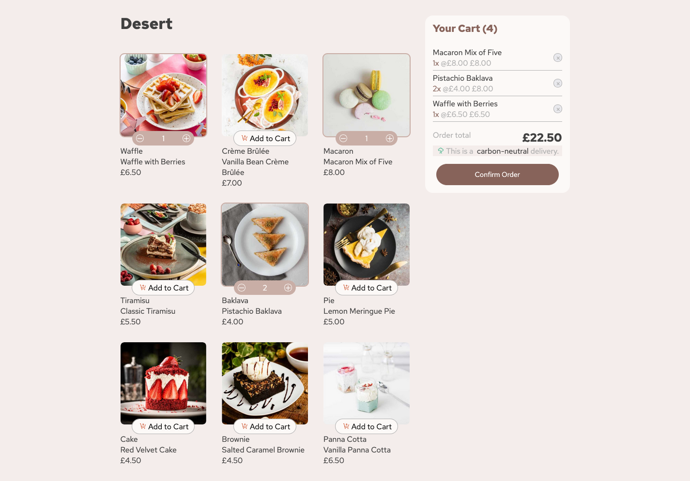
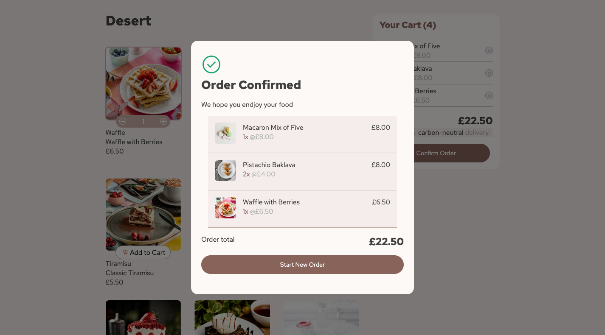
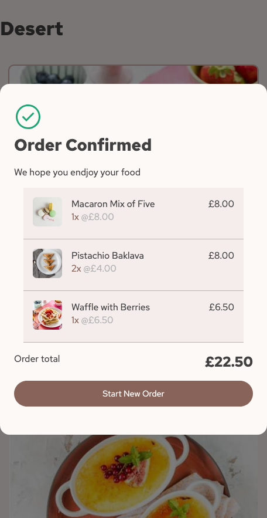

# Frontend Mentor - Product list with cart solution

For prospective employers, jump to My Process section for summary.

This is a solution to the [Product list with cart challenge on Frontend Mentor](https://www.frontendmentor.io/challenges/product-list-with-cart-5MmqLVAp_d). Frontend Mentor challenges help you improve your coding skills by building realistic projects.

## Table of contents

- [Overview](#overview)
  - [The challenge](#the-challenge)
  - [Screenshot](#screenshot)
  - [Links](#links)
- [My process](#my-process)
  - [Built with](#built-with)

## Overview

### The challenge

Users should be able to:

- Add items to the cart and remove them
- Increase/decrease the number of items in the cart
- See an order confirmation modal when they click "Confirm Order"
- Reset their selections when they click "Start New Order"
- View the optimal layout for the interface depending on their device's screen size
- See hover and focus states for all interactive elements on the page

### Screenshot

Screenshots are in /screenshots

## My process

[Live Demo](https://roddy-dev.github.io/FrontEndMentor-shopping-cart/)

I wanted to build on my Reactjs and plain CSS skills. I used vite to scaffold the project.
Most of the pointers to react were from "The Road to React" book by Robin Wieruth and shopping cart ideas were from Kyle of webdevsimplified. I tried various methods of modals, the one I was most happy with was from this article https://javascript.plainenglish.io/creating-modals-with-react-portal-40829c33a626 which didn't require any packages and was fairly adaptable.
My css is located in one CSS file as it was a fairly simple project, naming clashes shouldn't be a problem. The principles I followed were mobile first, and most of the good methodologies from Kevin Powells CSS demystified course(highly recommeneded).
I found a few stumbling blocks along the way, but this just added to the learning experience and with a bit of perseverence I was able to overcome them.
I was quite pleased with the fact I moved image handling to a helper function when it came to deployment. This meant I could tackle the problems associated with differing base-urls in one place and in vite config, and after modifications it was a bonus to rerun tests and see them pass.

All in all, an enjoyable project.

### Built with

- Semantic HTML5 markup
- CSS custom properties
- Flexbox
- CSS Grid
- Mobile-first workflow
- [React](https://reactjs.org/) - JS library
- [Vite] (vite.dev) - fast front end build tool

## Setup

Please feel free to fork or clone this repo and play with it. You will need node and npm to run. (I had npm v10.9.0 and node v20.5.1 ) at the time of writing.

Then the usual npm install and npm run dev in you chosen directory.
